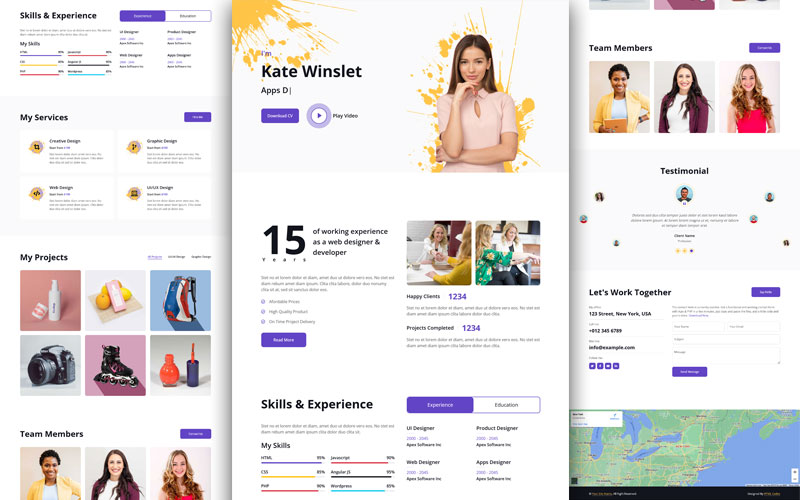

# Rajarshi Bhowmik - Portfolio Website

A modern, responsive full-stack portfolio website built with React + Node.js/Express.



## 🚀 Features

- **Modern React Frontend** - Vite, TypeScript, Tailwind CSS, Framer Motion
- **Express.js Backend** - REST API, MongoDB, TypeScript
- **Dark/Light Theme** - Persistent theme toggle with system preference detection
- **Responsive Design** - Mobile-first, works on all devices
- **Contact Form** - Working email notifications via Nodemailer
- **Admin API** - Secure endpoints for content management
- **SEO Optimized** - Meta tags, Open Graph, semantic HTML
- **Accessible** - WCAG compliant, keyboard navigable

## 📁 Project Structure

```
├── frontend/          # React SPA (Vite + TypeScript)
│   ├── src/
│   │   ├── components/  # UI components
│   │   ├── hooks/       # Custom React hooks
│   │   ├── pages/       # Route pages
│   │   ├── lib/         # Animation configs
│   │   └── utils/       # API client
│   └── package.json
├── backend/           # Express API (TypeScript)
│   ├── src/
│   │   ├── models/      # Mongoose schemas
│   │   ├── routes/      # API endpoints
│   │   ├── middleware/  # Auth, validation
│   │   └── services/    # Email, etc.
│   └── package.json
├── docker-compose.yml # Production Docker setup
└── index.html         # Legacy static site
```

## 🛠️ Quick Start

### Prerequisites
- Node.js 18+
- MongoDB (local or Atlas)
- npm or pnpm

### Backend Setup
```bash
cd backend
npm install
cp .env.example .env
# Edit .env with your MongoDB URI and SMTP settings
npm run seed   # Populate database
npm run dev    # Start at http://localhost:5000
```

### Frontend Setup
```bash
cd frontend
npm install
cp .env.example .env
npm run dev    # Start at http://localhost:5173
```

### Docker (Full Stack)
```bash
# Development with hot reload
docker-compose -f docker-compose.dev.yml up

# Production build
docker-compose up --build
```

## 🔌 API Endpoints

| Method | Endpoint | Description |
|--------|----------|-------------|
| GET | `/api/site` | Site settings |
| GET | `/api/projects` | List projects |
| GET | `/api/projects/:slug` | Project details |
| GET | `/api/experience` | Experience timeline |
| POST | `/api/contact` | Submit contact form |
| GET | `/health` | Health check |

Admin endpoints require Basic Auth (see `.env`).

## 🎨 Customization

### Theme Colors
Edit `frontend/tailwind.config.js`:
```javascript
colors: {
  primary: {
    DEFAULT: '#6244C5',  // Change this
  }
}
```

### Content
1. Edit seed data in `backend/src/scripts/seed.ts`
2. Run `npm run seed` to update database
3. Or use admin API endpoints

## 📦 Deployment

### Frontend (Vercel)
```bash
cd frontend
npm run build
# Deploy dist/ to Vercel
```

### Backend (Render/Railway)
1. Connect your repo
2. Set environment variables
3. Build command: `npm run build`
4. Start command: `npm start`

## 🧪 Testing
```bash
# Backend tests
cd backend && npm test

# Frontend tests
cd frontend && npm test
```

## 📄 License

MIT License - see [LICENSE.txt](LICENSE.txt)

## 👤 Author

**Rajarshi Bhowmik**
- GitHub: [@Rajarshi8](https://github.com/Rajarshi8)
- LinkedIn: [rajarshi-bhowmik](https://linkedin.com/in/rajarshi-bhowmik-4419212b8)
- Twitter: [@Rajo_7811](https://x.com/Rajo_7811)
